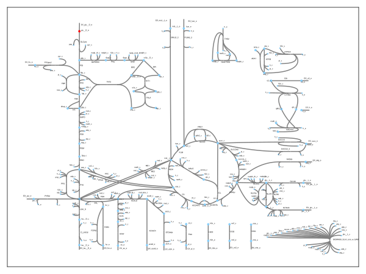
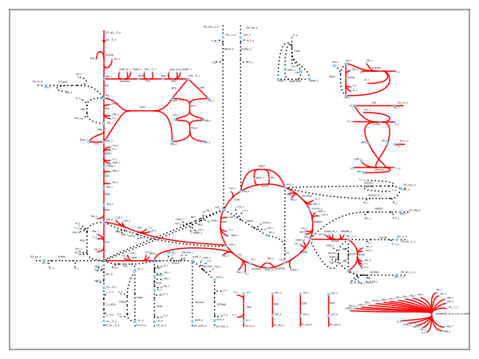
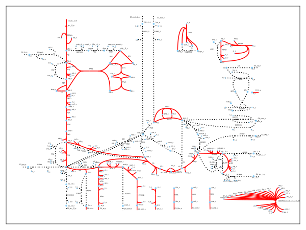
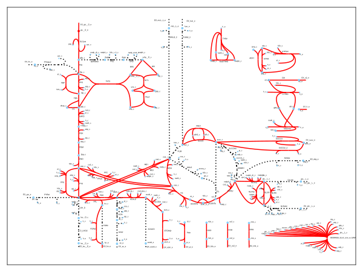

# Constraint-based metabolic modeling using COBRA and FBA

TODO: TL;DR description (technical)

## Metabolism

What is metabolism? It's a set of chemical reactions that can be found in organisms and are key for sustaining life.
They are either reactions that *break down* things (compounds such as glucose) or *synthesize* things (compounds such as proteins, carbohydrates, lipids and nucleic acids).
Usually, breaking compounds down releases energy, while synthesizing compounds consumes energy.
This energy flow happens under very specific rules, as all organisms obey the laws of thermodynamics.
The second law states that in an isolated system the amount of entropy cannot decrease, which seems to contradict the complexity that can be found in living systems.
The key here is that organisms are, in fact, open systems, which exchange matter and energy with their environment; dissipative systems that maintain complexity by increasing the entropy of their environment.
The metabolism of a cell achieves this by coupling the spontaneous processes of breaking down things, with the non-spontaneous processes of synthesizing things.
Some example mechanisms are [bacteriorhodopsin](https://pdb101.rcsb.org/motm/27), or the [redox loop](https://www.sciencedirect.com/science/article/pii/S0014579303003892#:~:text=Redox%20loops%20are%20found%20in,opposite%20sides%20of%20the%20membrane.). You can see [this](https://www.ncbi.nlm.nih.gov/pmc/articles/PMC5389199/) for an example.

These chemical reactions are organized into metabolic pathways, along which a chemical gets transformed into another chemical through a series of steps.
Each step happens with the help of an enzyme, which is exactly what couples the reactions to other more thermodynamically favorable ones, catalyze the reactions so that they proceed faster, and regulate the rate at which they occur.
The basic metabolic pathways are found among vastly different species.
For example, the set of carboxylic acids that are best known as the intermediates in the citric acid cycle are present in all known organisms.
Central pathways of metabolism, such as glycolysis and the citric acid cycle, are present in all three domains of living things and were present in the last universal common ancestor (LUCA).
Understanding how metabolism came to be and whether it can actually kickstart life ([example](https://www.pnas.org/doi/full/10.1073/pnas.0912628107)) is another topic of great study, and while it is a very complex process with a lot of participating intertwined mechanisms, it could have originated as something [much simpler](https://www.nature.com/articles/s41557-020-00560-7). Also see [this](https://www.nature.com/articles/nature19776).

Through metabolism we can also produce biofuels ([here](https://www.science.org/doi/10.1126/science.1114736), [here](https://link.springer.com/article/10.1007/s00253-007-1163-x) and [here](https://www.sciencedirect.com/science/article/pii/S0092867421000957)) or [healthy food](https://www.sciencedirect.com/science/article/pii/S1096717620300331), [biopolymers](https://www.sciencedirect.com/science/article/pii/S1096717619300886), [amino acids](https://www.sciencedirect.com/science/article/pii/S1096717619301004) and more.

## TODO: Math stuff

The enzymes that facilitate all of these chemical reactions are produced through a process which involves some cell genes.
How much of an enzyme is produced has to do with how much the corresponding gene or genes are used (expressed).
Recent advances in Synthetic Biology (such as [being able to modify a single DNA base](https://www.nature.com/articles/nature24644), [rapidly delete endogenous genes](https://www.nature.com/articles/srep17874), [insert entirely new genes](https://www.science.org/doi/full/10.1126/science.aac9373), or onto something more metabolism-related, [regulate enzyme expression](https://www.sciencedirect.com/science/article/pii/S240547122030418X)) mean that we now can directly intervene and change a cell to have it do our bidding.
That means we now have to understand what exactly to change in the cell to have the desirable results.
In other words, we need to better understand how, systematically, changes at the gene level affect an organism's metabolism.

To do this, we can use a great variety of techniques, some of which can be found [here](https://www.nature.com/articles/nrg3643).
We use something called COBRA (COnstraint-Based Reconstruction and Analysis) which means you gather details on all of the chemical reactions that are encoded for by the genes of the organisms; the reactions [are linked to specific genes](https://www.nature.com/articles/nbt.3956).
Then, we can use an optimization technique called [Flux Balance Analysis](https://www.nature.com/articles/nbt.1614) to predict how the enzymes work, and thus to predict how the reaction set would change if the genes were modified.

The model used in this repository is a [toy model](https://journals.asm.org/doi/10.1128/ecosalplus.10.2.1) of some parts of the central metabolism of *Escherichia Coli*.
It includes glycolysis, the TCA or CAC or Krebs cycle, and the electron transport chain:

Here, the edges are chemical reactions, and the nodes are metabolites.
Glucose (in red) is converted into ATP and other metabolic precursors used to create more cells (biomass).
The majority of these reactions actually exist in *E. coli*, but not those lumped in the bottom right.
These are what's called the biomass objective function, which is a pseudo reaction that groups all the processes that weren't modeled and that convert the metabolites generated by what's been modeled into biomass. 
This is an assumption due to the constraint-based approaches requiring the organisms to have adapted their metabolism, through evolution, to optimize some objective.
The specific assumption taken to hold here is that the metabolism has been tuned to maximize growth rate (biomass).
There initiallly were some studies showing that optimizing the assumed objective function for growth ([here](https://www.nature.com/articles/nature01149)) and for energy use ([here](https://pubmed.ncbi.nlm.nih.gov/15052634/) and [here](https://pubmed.ncbi.nlm.nih.gov/14705007/)) you could predict the metabolic fluxes.
Other studies seemed to question this universality ([here](https://journals.plos.org/ploscompbiol/article?id=10.1371/journal.pcbi.1003091), [here](https://www.ncbi.nlm.nih.gov/pmc/articles/PMC1949037/) and [here](https://pubmed.ncbi.nlm.nih.gov/19888218/)).
Today the representation of the *in vivo* fluxes is thought of as a Pareto surface created from combining three objective functions: maximizing biomass and ATP generation, and minimizing the fluxes across the whole network ([here](https://www.science.org/doi/10.1126/science.1216882)).

In FBA, the reaction network is represented in the compact form of a stoichiometric matrix ( $S$ ), as is common, with $m$ rows and $n$ columns, for $n$ chemical reactions and $m$ participating compounds.
The column entries are the stoichiometric coefficients of the metabolites that participate in the corresponding reaction, where there's a negative coefficient if the metabolite is consumed and a positive coefficient if it's produced.
If a metabolite does not participate in a chemical reaction, the corresponding stoichiometric coefficient is zero.
$S$ is a sparse matrix, since the reactions usually involve only a handful of metabolites.
The flux through all the reactions across the network is represented by a vector $v$, of length $n$, for the $n$ reactions.
Respectively, a vector $x$ with length $m$ represents the concentrations of all the metabolites.
You can get the system containing all mass balance equations at steady state by solving for $$\frac{dx}{dt} = 0$$

---

$$Sv = 0$$

Any vector $v$ that satisfies this equation is in the null space of $S$.
In realistic, large-scale models, there are more reactions than there are compounds ( $n > m$ ) which means there are more unknown variables in the system than equations, so there is no single, unique solution to this system.
The solution space is defined by imposing the $Sv = 0$ mass balance constraints and capacity constraints imposed by manually selected lower and upper bounds.
What FBA does is it looks into specific points within that solution space.
For instance, while you might have various viable configurations, you might be interested to see which point within the solution space corresponds to maximizing biomass production, or maximizing the production of a compound, given the already present collection of constraints.

FBA, as a method that seeks to identify optimal points within a constrained space, optimizes an objective function $$ Z = c^Tv $$

This can generally be any (linear) combination of fluxes, with $c$ being a vector containing weights that indicate how much a chemical reaction contributes to the objective function.
If optimizing only for a single reaction, e.g. biomass production, $c$ will be a vector of zeros with an entry of one only at the position of the reaction optimizing for.

Lastly, to optimize this system linear programming methods are used to solve $ Sv = 0 $, given the set of lower and upper bounds on $ v $ and a linear combination of fluxes as an objective function.
The resulting flux distribution $v$ maximizes or minimizes the selected objective function.
Because FBA reduces the large-scale, complex metabolic model to a linear program, it is quite performant and scales well.
The FBA computations fall into the broader category of COnstraint-Based Reconstruction and Analysis (COBRA) methods.

## TODO: Code stuff

## TODO: Results

Workflow oneliner examples using various util functions:

- `readcsv(constructpath(["results", "csv"], "ko_genes_reactions.csv")) |> df_to_fluxes |> flux_summary`
- `writeio(readcsv(constructpath(["results", "csv"], "max_etoh_reactions.csv")) |> tomarkdown, constructpath(["results", "markdown"], "max_etoh_reactions.md"))`

---

Click to see results table

|         Reaction         |    Flux     |
|--------------------------|-------------|
|          ACALD           | -5.65944e-9 |
|           PTAr           | 3.41401e-9  |
|          ALCD2x          | -1.4328e-9  |
|           PDH            |   9.28253   |
|           PYK            |   1.75818   |
|           CO2t           |  -22.8098   |
|         EX_nh4_e         |  -4.76532   |
|         MALt2_2          |     0.0     |
|            CS            |   6.00725   |
|           PGM            |  -14.7161   |
|           TKT1           |   1.49698   |
|       EX_mal__L_e        |     0.0     |
|          ACONTa          |   6.00725   |
|         EX_pi_e          |   -3.2149   |
|           GLNS           |  0.223462   |
|           ICL            | 2.89785e-7  |
|         EX_o2_e          |  -21.7995   |
|           FBA            |   7.47738   |
|       EX_gln__L_e        |     0.0     |
|       EX_glc__D_e        |    -10.0    |
|          SUCCt3          | 2.55048e-8  |
|          FORt2           | 1.14358e-7  |
|         G6PDH2r          |   4.95999   |
|          AKGDH           |   5.06438   |
|           TKT2           |   1.1815    |
|           FRD7           |    490.0    |
|          SUCOAS          |  -5.06438   |
| BIOMASS_Ecoli_core_w_GAM |  0.873922   |
|           FBP            | 1.50898e-8  |
|          ICDHyr          |   6.00725   |
|          AKGt2r          | -3.84984e-9 |
|          GLUSy           | 9.04494e-9  |
|           TPI            |   7.47738   |
|           FORt           | -1.33188e-7 |
|          ACONTb          |   6.00725   |
|         EX_ac_e          | 3.41403e-9  |
|          GLNabc          |     0.0     |
|         EX_akg_e         | 3.84984e-9  |
|         EX_fru_e         |     0.0     |
|           RPE            |   2.67848   |
|           ACKr           | -3.41402e-9 |
|           THD2           | 3.37384e-7  |
|           PFL            | 1.88301e-8  |
|           RPI            |   -2.2815   |
|         D_LACt2          | -2.39187e-9 |
|           TALA           |   1.49698   |
|       EX_glu__L_e        |  3.3699e-9  |
|           ATPM           |    8.39     |
|           PPCK           | 5.88221e-8  |
|          ACt2r           | -3.41402e-9 |
|        EX_etoh_e         | 1.43282e-9  |
|           NH4t           |   4.76532   |
|           PGL            |   4.95999   |
|         NADTRHD          |  5.3881e-7  |
|           PGK            |  -16.0235   |
|          LDH_D           | -2.39186e-9 |
|           ME1            | 4.81777e-8  |
|          PIt2r           |   3.2149    |
|         EX_h2o_e         |   29.1758   |
|        EX_succ_e         | 1.53072e-9  |
|          ATPS4r          |   45.514    |
|          PYRt2           | -3.92523e-9 |
|        EX_acald_e        | 4.22665e-9  |
|          EX_h_e          |   17.5309   |
|          GLCpts          |    10.0     |
|          GLUDy           |  -4.54186   |
|          CYTBD           |   43.599    |
|         FUMt2_2          |     0.0     |
|         FRUpts2          |     0.0     |
|           GAPD           |   16.0235   |
|           H2Ot           |  -29.1758   |
|           PPC            |   2.50431   |
|          NADH16          |   38.5346   |
|           PFK            |   7.47738   |
|         EX_for_e         | 1.88301e-8  |
|           MDH            |   5.06438   |
|           PGI            |   4.86086   |
|           O2t            |   21.7995   |
|           ME2            |  1.4966e-7  |
|         EX_pyr_e         | 3.92523e-9  |
|         EX_co2_e         |   22.8098   |
|           GND            |   4.95999   |
|         SUCCt2_2         | 2.39741e-8  |
|           GLUN           | 9.94954e-9  |
|         EX_fum_e         |     0.0     |
|         ETOHt2r          | -1.43281e-9 |
|           ADK1           | 2.86618e-8  |
|          ACALDt          | -4.22664e-9 |
|          SUCDi           |   495.064   |
|       EX_lac__D_e        | 2.39187e-9  |
|           ENO            |   14.7161   |
|           MALS           | 2.89785e-7  |
|          GLUt2r          | -3.36991e-9 |
|           PPS            | 2.86618e-8  |
|           FUM            |   5.06438   |

---

Click to see results table

|         Reaction         |     Flux     |
|--------------------------|--------------|
|          ACALD           |   -8.27946   |
|           PTAr           |   8.50359    |
|          ALCD2x          |   -8.27946   |
|           PDH            |  6.66064e-8  |
|           PYK            |   8.40427    |
|           CO2t           |   0.378178   |
|         EX_nh4_e         |   -1.15416   |
|         MALt2_2          |     0.0      |
|            CS            |   0.228363   |
|           PGM            |   -19.1207   |
|           TKT1           |  -0.0378665  |
|       EX_mal__L_e        |     0.0      |
|          ACONTa          |   0.228363   |
|         EX_pi_e          |  -0.778644   |
|           GLNS           |  0.0541222   |
|           ICL            |  1.60351e-9  |
|         EX_o2_e          |     0.0      |
|           FBA            |   9.78946    |
|       EX_gln__L_e        |     0.0      |
|       EX_glc__D_e        |    -10.0     |
|          SUCCt3          |  1.4142e-8   |
|          FORt2           |  1.85814e-8  |
|         G6PDH2r          |  1.01601e-7  |
|          AKGDH           |  1.1816e-9   |
|           TKT2           |  -0.114277   |
|           FRD7           |   492.856    |
|          SUCOAS          | -1.18159e-9  |
| BIOMASS_Ecoli_core_w_GAM |   0.211663   |
|           FBP            |  2.38026e-9  |
|          ICDHyr          |   0.228363   |
|          AKGt2r          | -1.90741e-9  |
|          GLUSy           | 8.29697e-10  |
|           TPI            |   9.78946    |
|           FORt           |   -17.8047   |
|          ACONTb          |   0.228363   |
|         EX_ac_e          |   8.50359    |
|          GLNabc          |     0.0      |
|         EX_akg_e         |  1.90734e-9  |
|         EX_fru_e         |     0.0      |
|           RPE            |  -0.152143   |
|           ACKr           |   -8.50359   |
|           THD2           |   3.62919    |
|           PFL            |   17.8047    |
|           RPI            |  -0.152143   |
|         D_LACt2          | -4.91612e-9  |
|           TALA           |  -0.0378665  |
|       EX_glu__L_e        | 9.61386e-10  |
|           ATPM           |     8.39     |
|           PPCK           |  2.06388e-9  |
|          ACt2r           |   -8.50359   |
|        EX_etoh_e         |   8.27946    |
|           NH4t           |   1.15416    |
|           PGL            |  1.01601e-7  |
|         NADTRHD          |  1.11162e-8  |
|           PGK            |   -19.4373   |
|          LDH_D           | -4.91614e-9  |
|           ME1            |  2.02658e-9  |
|          PIt2r           |   0.778644   |
|         EX_h2o_e         |   -7.1158    |
|        EX_succ_e         |  1.00725e-8  |
|          ATPS4r          |   -5.45205   |
|          PYRt2           | -5.00048e-9  |
|        EX_acald_e        |  5.5162e-9   |
|          EX_h_e          |   30.5542    |
|          GLCpts          |     10.0     |
|          GLUDy           |   -1.10003   |
|          CYTBD           |     0.0      |
|         FUMt2_2          |     0.0      |
|         FRUpts2          |     0.0      |
|           GAPD           |   19.4373    |
|           H2Ot           |    7.1158    |
|           PPC            |   0.606541   |
|          NADH16          |  7.28745e-9  |
|           PFK            |   9.78946    |
|         EX_for_e         |   17.8047    |
|           MDH            | -1.34507e-8  |
|           PGI            |   9.95661    |
|           O2t            |     0.0      |
|           ME2            |  5.74003e-9  |
|         EX_pyr_e         |  5.00046e-9  |
|         EX_co2_e         |  -0.378178   |
|           GND            |  1.01601e-7  |
|         SUCCt2_2         |  4.06942e-9  |
|           GLUN           | 7.09021e-10  |
|         EX_fum_e         |     0.0      |
|         ETOHt2r          |   -8.27946   |
|           ADK1           |  3.06499e-9  |
|          ACALDt          | -5.51622e-9  |
|          SUCDi           |   492.856    |
|       EX_lac__D_e        |  4.91611e-9  |
|           ENO            |   19.1207    |
|           MALS           |  1.60347e-9  |
|          GLUt2r          | -9.61448e-10 |
|           PPS            |  3.06496e-9  |
|           FUM            | -7.28752e-9  |

---

Click to see results table

|         Reaction         |     Flux     |
|--------------------------|--------------|
|          ACALD           |   -18.4801   |
|           PTAr           | 9.30969e-13  |
|          ALCD2x          |   -18.4801   |
|           PDH            |   18.6499    |
|           PYK            |   7.35964    |
|           CO2t           |   -18.4713   |
|         EX_nh4_e         |   -0.54528   |
|         MALt2_2          |     0.0      |
|            CS            |   0.10789    |
|           PGM            |   -19.5846   |
|           TKT1           |   -0.01789   |
|       EX_mal__L_e        |     0.0      |
|          ACONTa          |   0.10789    |
|         EX_pi_e          |   -0.36787   |
|           GLNS           |   1.48252    |
|           ICL            | 4.74617e-13  |
|         EX_o2_e          |  -0.0319401  |
|           FBA            |   9.90053    |
|       EX_gln__L_e        |     0.0      |
|       EX_glc__D_e        |    -10.0     |
|          SUCCt3          |   1.15259    |
|          FORt2           |   5.96336    |
|         G6PDH2r          | 3.20267e-11  |
|          AKGDH           | 3.36493e-12  |
|           TKT2           |   -0.05399   |
|           FRD7           |   491.901    |
|          SUCOAS          | -3.30308e-12 |
| BIOMASS_Ecoli_core_w_GAM |     0.1      |
|           FBP            |   0.66076    |
|          ICDHyr          |   0.10789    |
|          AKGt2r          | -2.2679e-12  |
|          GLUSy           |   0.704085   |
|           TPI            |   9.90053    |
|           FORt           |   -6.27626   |
|          ACONTb          |   0.10789    |
|         EX_ac_e          | 1.18871e-12  |
|          GLNabc          |     0.0      |
|         EX_akg_e         | 2.44418e-12  |
|         EX_fru_e         |     0.0      |
|           RPE            |   -0.07188   |
|           ACKr           | -1.01656e-12 |
|           THD2           |   2.22216    |
|           PFL            |    0.3129    |
|           RPI            |   -0.07188   |
|         D_LACt2          | -6.48811e-12 |
|           TALA           |   -0.01789   |
|       EX_glu__L_e        | 2.94048e-12  |
|           ATPM           |   8.83682    |
|           PPCK           |   0.661514   |
|          ACt2r           | -1.10257e-12 |
|        EX_etoh_e         |   18.4801    |
|           NH4t           |   0.54528    |
|           PGL            | 3.20673e-11  |
|         NADTRHD          |   1.68498    |
|           PGK            |   -19.7342   |
|          LDH_D           | -6.48915e-12 |
|           ME1            |   0.775277   |
|          PIt2r           |   0.36787    |
|         EX_h2o_e         |   0.71954    |
|        EX_succ_e         | 1.80232e-11  |
|          ATPS4r          |   0.561831   |
|          PYRt2           | -3.47462e-12 |
|        EX_acald_e        |  3.6606e-12  |
|          EX_h_e          |    2.3189    |
|          GLCpts          |     10.0     |
|          GLUDy           |   0.184375   |
|          CYTBD           |  0.0638802   |
|         FUMt2_2          |     0.0      |
|         FRUpts2          |     0.0      |
|           GAPD           |   19.7342    |
|           H2Ot           |   -0.71954   |
|           PPC            |   2.90079    |
|          NADH16          |  0.0638802   |
|           PFK            |   10.5613    |
|         EX_for_e         |    0.3129    |
|           MDH            |   -1.95271   |
|           PGI            |    9.9795    |
|           O2t            |  0.0319401   |
|           ME2            |   1.17743    |
|         EX_pyr_e         | 3.51713e-12  |
|         EX_co2_e         |   18.4713    |
|           GND            | 3.20642e-11  |
|         SUCCt2_2         |   1.15259    |
|           GLUN           |   0.752862   |
|         EX_fum_e         |     0.0      |
|         ETOHt2r          |   -18.4801   |
|           ADK1           |  0.0662497   |
|          ACALDt          | -3.61812e-12 |
|          SUCDi           |   491.901    |
|       EX_lac__D_e        | 6.48726e-12  |
|           ENO            |   19.5846    |
|           MALS           | 4.99625e-13  |
|          GLUt2r          | -2.80789e-12 |
|           PPS            |  0.0662497   |
|           FUM            | -1.42832e-11 |

